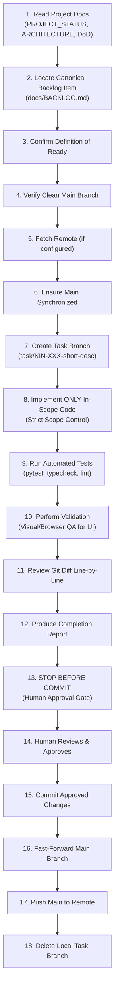

# AI Agent Development Workflow

This document defines the mandatory, step-by-step operating procedure for AI coding assistants working in the KIN repository. Every implementation task must adhere strictly to this lifecycle.

---

## The 18-Step Development Lifecycle

### Detailed Step Guidelines

1. **Read Relevant Documentation:** Review `docs/PROJECT_STATUS.md`, `docs/ARCHITECTURE.md`, and `docs/DEFINITION_OF_DONE.md` to understand current reality and boundaries.
2. **Locate Canonical Backlog Item:** Identify the exact item in `docs/BACKLOG.md` (e.g., `KIN-001`). If no item exists for the requested work, **STOP and ask the human lead to create or approve one.**
3. **Confirm Definition of Ready (DoR):** Verify that the backlog item has clear goals, rationale, dependencies resolved, and testable acceptance criteria. If ambiguous, STOP and clarify.
4. **Verify Clean Main:** Ensure your working tree is clean (`git status`) and you are on `main`.
5. **Fetch Remote:** Run `git fetch origin` if a remote repository is configured.
6. **Ensure Main is Synchronized:** Ensure `main` matches upstream without local untracked or unpushed drift.
7. **Create Short-Lived Task Branch:** Branch from `main` using naming convention `task/KIN-XXX-short-description` (e.g., `task/KIN-001-backend-lint-config`).
8. **Implement In-Scope Code Only:** Modify only the files strictly required to satisfy the backlog item. Never perform opportunistic refactoring, styling changes, or "while-I-was-here" fixes.
9. **Execute Automated Tests:**
   - Backend: Run `pytest` and `ruff check backend`.
   - Frontend: Run `npm run typecheck`, `npm run lint`, and `npm run build`.
10. **Execute Validation:** For UI tasks, validate rendered visuals across desktop, tablet, and mobile dimensions.
11. **Review Diff Line-by-Line:** Run `git diff` and verify that every addition or deletion directly supports the acceptance criteria.
12. **Produce Completion Report:** Deliver a structured report detailing files changed, tests run, validation outcomes, and remaining decisions.
13. **STOP Before Commit:** **DO NOT run `git commit`, `git push`, or merge into `main` without explicit human authorization.**
14. **Human Review:** The human project lead reviews the diff, completion report, and test results.
15. **Commit:** Upon receiving explicit approval, commit changes with a conventional commit message referencing the backlog item ID (e.g., `fix(lint): resolve ruff violations and configure bugbear [KIN-001]`).
16. **Fast-Forward Main:** Checkout `main` and fast-forward merge the task branch (`git merge --ff-only task/KIN-XXX-...`).
17. **Push Main:** Push updated `main` to the remote repository.
18. **Delete Task Branch:** Clean up the task branch locally (`git branch -d task/KIN-XXX-...`).

---

## Definition of Ready (DoR)

Before a task branch is opened, the backlog item must satisfy:
1. **Unambiguous Requirement:** The goal describes the exact user problem or engineering outcome.
2. **Explicit Scope:** In-scope files or components are identified; non-goals are stated if ambiguity is possible.
3. **Resolved Dependencies:** Pre-requisite tasks are already merged to `main`.
4. **Verifiable Acceptance Criteria:** Clear list of criteria that can be validated objectively.
5. **Test Strategy Defined:** The agent knows what unit, integration, or visual tests will prove completion.
