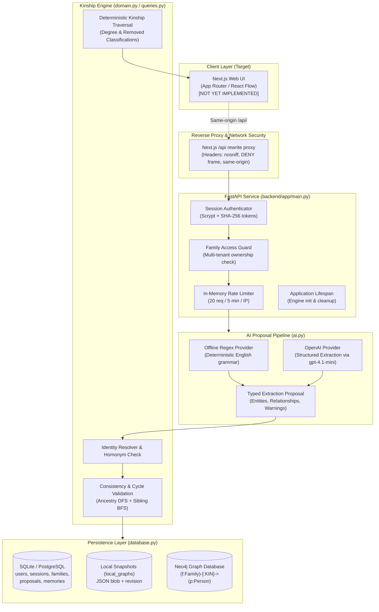
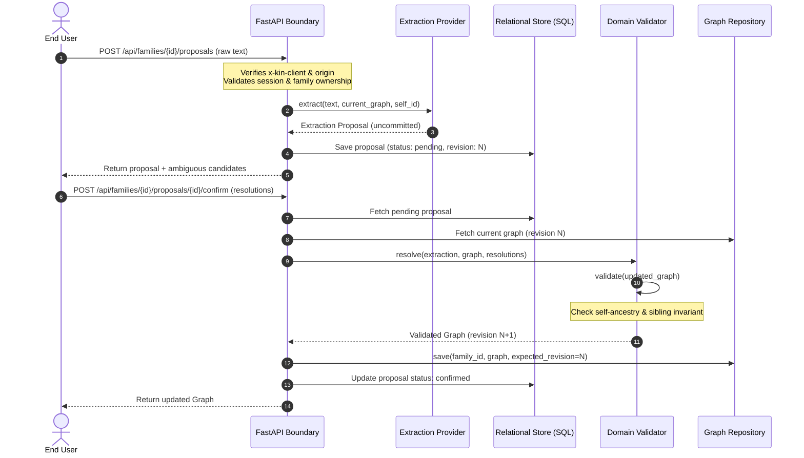
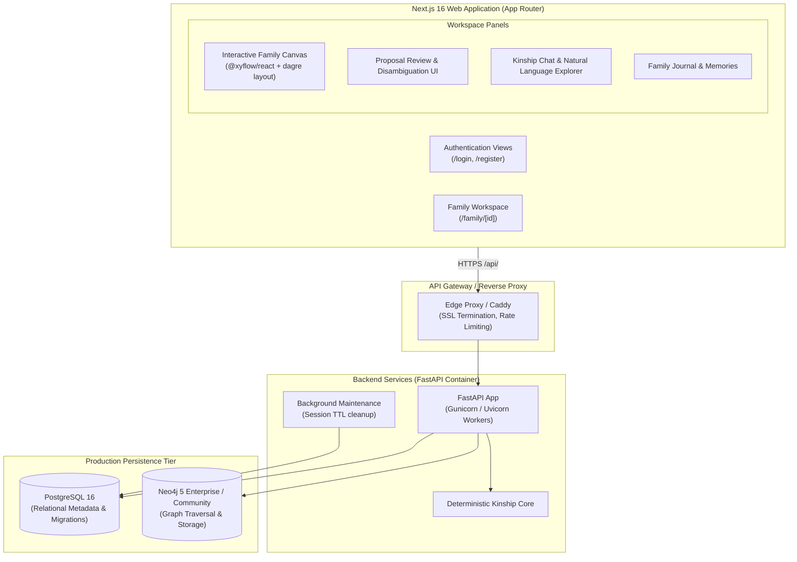

# KIN Architecture

This document specifies the software architecture for KIN. It explicitly separates the **Current Architecture** (verified by repository code) from the **Target Architecture** (planned for subsequent milestones).

---

## 1. CURRENT ARCHITECTURE

### System Overview

KIN is organized as a polyglot monorepo:
- **Backend:** Python (FastAPI + Pydantic v2 + SQLAlchemy v2) under `backend/app/`.
- **Frontend Workspace:** Next.js (TypeScript) build configuration under `frontend/` (application source code not yet implemented).
- **Core Reasoning Engine:** Pure Python deterministic graph traversal, cycle detection, and kinship classification (`backend/app/domain.py`, `backend/app/queries.py`). **No LLMs are used for graph reasoning or relationship determination.**

### Component Responsibilities

| Component | Files | Primary Responsibility |
| :--- | :--- | :--- |
| **API Entry & Routing** | `backend/app/main.py` | FastAPI application factory, lifespan management, HTTP middleware (origin validation, body size caps), session auth, family authorization, and REST endpoints. |
| **Domain & Kinship Logic** | `backend/app/domain.py` | Graph schema validation, cycle prevention (circular ancestry, sibling-as-ancestor), identity resolution with homonym detection, and deterministic BFS kinship classification. |
| **Natural Language Queries** | `backend/app/queries.py` | Regex parsing of kinship questions ("Who is X to me?", "Show my cousins", descendant trees) and deterministic relationship explanations with evidence paths. |
| **AI Extraction Providers** | `backend/app/ai.py` | Translation of unstructured user text into typed `Extraction` proposals. Direct write access to persistence is completely prohibited. |
| **Data Models & Schemas** | `backend/app/schemas.py` | Strict Pydantic models with forbidden extra attributes: `Person`, `Edge`, `Graph`, `Extraction`, `Entity`, `Confirm`, and `MemoryCreate`. |
| **Persistence Repositories** | `backend/app/database.py` | SQLAlchemy database access for relational metadata; dual graph repositories (`LocalGraphRepository` using JSON snapshots, `Neo4jGraphRepository` using Cypher transactions). |
| **Demo Seeding** | `backend/app/seed.py` | Deterministic generation of an 8-person demo family graph for onboarding and sandbox testing. |

### Data Flow & Trust Boundaries

1. **Untrusted Input Ingestion:**
   User text enters `/api/families/{family_id}/proposals`. Request headers are validated against CSRF origin rules.
2. **AI Proposal Generation (Sandboxed):**
   The AI provider (`OfflineProvider` or `OpenAIProvider`) processes the text and emits an `Extraction` containing proposed entities and relationship edges. **The provider has zero database access.**
3. **Ambiguity & Homonym Staging:**
   If multiple existing family members share the same name, or if ambiguous candidates exist, `domain.resolve()` suspends automatic application and flags `candidates` for human review.
4. **Human Review & Confirmation:**
   The human user confirms the proposal via `/confirm`, providing explicit disambiguation mappings (`resolutions`).
5. **Deterministic Validation:**
   Before persisting, `domain.validate()` enforces:
   - Unique person identifiers.
   - All edge endpoints exist within the family graph.
   - No self-relationships.
   - No circular ancestry (a person cannot become their own ancestor).
   - No sibling-as-ancestor relationships.
6. **Optimistic Revision Storage:**
   The graph is written to the repository (`LocalGraphRepository` or `Neo4jGraphRepository`) with an expected revision check. If another mutation occurred concurrently, the write is aborted with `409 Conflict`.
7. **Deterministic Kinship Traversal:**
   When answering relationship questions or calculating paths (`/relationship` or `/query`), BFS graph traversal over undirected adjacency labels (`U` for parent, `D` for child, `S` for sibling, `W` for spouse) resolves the canonical kinship term (e.g., "second cousin, 1 time removed") and produces an evidence chain.

### Persistence Strategy

- **Dual-Engine Pattern:**
  - **Local Development Mode:** Uses SQLite (`sqlite:///./kin.db`) for all relational tables, plus a `local_graphs` table storing serialized graph snapshots with revision tracking.
  - **Production Mode:** PostgreSQL for relational tables (users, sessions, families, proposals, memories) and Neo4j for property graph persistence.
- **Transaction Boundary:**
  - Graph and SQL metadata do not share a distributed transaction (2PC).
  - Empty family creation is compensatable: if graph initialization fails, the SQL family record is deleted.
  - Neo4j mutations lock the `Family` root node, verify optimistic revision, replace the family's nodes/edges, and log the `applied` proposal ID atomically.

### Security Architecture

- **Authentication:** Stateful cookie sessions (`kin_session`). Session tokens are generated with 32 bytes of cryptographically secure random entropy (`secrets.token_urlsafe(32)`), hashed using SHA-256 before SQL insertion, and set with `HttpOnly`, `SameSite=Lax`, and configurable `Secure` flags.
- **Passwords:** Hashed with `scrypt` (`n=16384, r=8, p=1`) using a 16-byte random salt, validated with `hmac.compare_digest`.
- **Authorization:** Every family resource enforces tenant boundary via `family_access` dependency (`owner == user_id`).
- **CSRF Safeguards:** Non-idempotent endpoints verify `x-kin-client: web` header and origin parity against `config.app_origin`.
- **Payload Limits:** Request bodies on mutating requests are capped at 100,000 bytes.
- **Privacy & Logging:** Fast-fail logging records only route templates, status codes, and latency (`request route=%s status=%s duration_ms=%d`). No family member names, notes, or graph facts are written to logs.

### Known Architectural Limitations (Current)

1. **No Frontend Application Code:** Next.js application pages, layout, and visual components do not yet exist on disk.
2. **In-Memory Rate Limiting:** Rate limiter is confined to a local dictionary; restarts or multi-worker deployments bypass limits.
3. **Full-Graph Neo4j Replacement:** `Neo4jGraphRepository` deletes and recreates all family nodes and edges on each revision. While safe for the 500-node MVP boundary, it is not scalable to larger enterprise graphs.
4. **Lack of Automated Test Coverage:** Zero automated tests exist for domain logic or API endpoints.

---

## 2. TARGET ARCHITECTURE

The target architecture represents the planned state following Milestone M1 (Core Product Validation) and Milestone M2 (MVP Completion):

### Target Enhancements

1. **Frontend Application Layer:**
   - Next.js App Router workspace with responsive desktop, tablet, and mobile layouts.
   - Interactive genealogical canvas powered by `@xyflow/react` and `@dagrejs/dagre` hierarchical tree layout.
   - Visual disambiguation modal for homonyms and unresolved entities.
   - Natural language query bar with path highlighting on the family tree canvas.
2. **Testing Infrastructure:**
   - Unit test suite (`pytest`) covering 100% of `domain.py`, `schemas.py`, and `queries.py`.
   - API integration test suite (`pytest` + `httpx.ASGITransport`) testing auth, family scoping, and proposal lifecycles.
   - Playwright end-to-end browser suite validating desktop, tablet, and mobile workflows.
3. **Database Migration Tooling:**
   - Alembic migrations for PostgreSQL schema evolution.
4. **Production Rate Limiting & Session Hygiene:**
   - Distributed rate limiting (Redis or PostgreSQL token bucket).
   - Automated cleanup job for expired session records.
