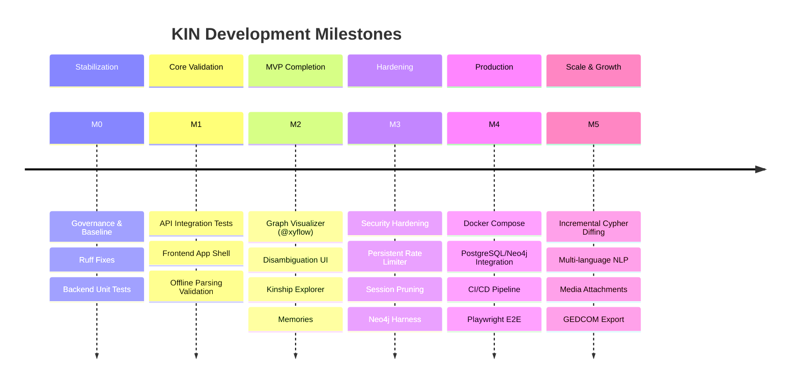

# KIN Product & Technical Roadmap

This roadmap organizes the evolution of KIN from its current prototype state into a production-grade, AI-assisted personal genealogy workspace.

---

## Milestone Overview

---

## M0 — Repository Stabilization & Engineering Baseline

**Goal:** Establish a solid engineering foundation, eradicate lint errors, establish a 100% passing test baseline for domain logic, and lock down configuration hygiene.

- [x] **KIN-001 (P0): Backend Lint & Code Quality Configuration**
  - Configure Ruff in `pyproject.toml` or `ruff.toml` to recognize `fastapi.Depends` as immutable (`extend-immutable-calls`).
  - Fix regex alias warnings (`re.I` -> `re.IGNORECASE`).
  - Achieve clean `ruff check backend` with 0 warnings/errors.
- [x] **KIN-002 (P0): Backend Domain & Kinship Unit Test Suite**
  - Author comprehensive `pytest` suite for `backend/app/domain.py` (kinship classification, cousins, in-laws, great-relatives).
  - Test cycle detection (circular ancestry DFS) and sibling invariants.
  - Test homonym detection and identity resolution edge cases.
- [x] **KIN-003 (P0): Environment & Developer Configuration**
  - Create `.env.example` documenting all configuration options (`DATABASE_URL`, `GRAPH_BACKEND`, `AI_PROVIDER`, `OPENAI_API_KEY`, `APP_ORIGIN`, etc.).
  - Document local setup commands in a top-level `README.md`.

**Acceptance Criteria for M0:**
- `ruff check backend` passes with 0 issues.
- `pytest` executes a minimum of 25 comprehensive unit tests with 100% pass rate.
- Clear environment documentation and developer bootstrapping guide.

---

## M1 — Core Product Validation & API Harness

**Goal:** Validate all FastAPI endpoints via automated integration tests and establish the Next.js frontend scaffolding.

- [ ] **KIN-004 (P0): FastAPI Integration Test Suite**
  - Author API test suite using `pytest` + `httpx.ASGITransport` against an in-memory or temporary SQLite database.
  - Validate authentication flows (register, login, logout, invalid passwords, rate-limiting).
  - Validate family scoping and tenant boundary enforcement (reject accessing foreign family ID).
  - Validate proposal creation, ambiguous homonym returns, and confirmation lifecycle.
  - Validate memory CRUD operations and natural language query endpoints.
- [ ] **KIN-005 (P0): Frontend Next.js Foundation & Scaffolding**
  - Initialize the Next.js App Router structure in `frontend/` (`app/layout.tsx`, `app/page.tsx`, `app/globals.css`).
  - Configure CSS / styling tokens (clean dark mode palette, modern typography, glassmorphism accents).
  - Verify that `npm run build` (`next build`), `npm run lint`, and `npm run typecheck` all pass cleanly.
- [ ] **KIN-006 (P1): Offline NLP Extraction Test Suite**
  - Comprehensive unit testing for `OfflineProvider` regex grammar patterns.
  - Boundary test failure cases (rejecting unconsumed text, missing names).

**Acceptance Criteria for M1:**
- `pytest` executes end-to-end API lifecycle tests with 100% pass rate.
- `frontend/` compiles successfully with `npm run build` producing zero build errors.

---

## M2 — MVP Completion (Interactive Web Workspace)

**Goal:** Deliver a functional, interactive user interface connecting the Next.js frontend to the backend API.

- [ ] **KIN-007 (P1): Interactive Family Graph Visualizer**
  - Implement canvas component using `@xyflow/react` and `@dagrejs/dagre` for automated hierarchical layout.
  - Render custom person nodes displaying name, gender, birth/death dates, and connection handles.
  - Support zoom, pan, fit-to-view, and node selection.
- [ ] **KIN-008 (P1): Proposal Review & Disambiguation Panel**
  - Conversational input drawer for entering relationship statements.
  - Interactive proposal diff viewer showing proposed additions and warnings before confirmation.
  - Disambiguation modal allowing users to resolve homonyms (choose existing person vs create new).
- [ ] **KIN-009 (P1): Kinship Query & Relationship Explorer UI**
  - Query input bar supporting natural language kinship questions ("Who is Raj to me?", "Show my cousins").
  - Two-person relationship picker with animated path highlight on the `@xyflow` canvas.
  - Explanation panel displaying canonical relationship label and textual evidence chain.
- [ ] **KIN-010 (P2): Family Story & Memory Journal UI**
  - Memory feed panel with author, timestamp, and tagged person badges.
  - Memory creation dialog with person tag selector.
  - Instant client-side and server-side text search over memories.

**Acceptance Criteria for M2:**
- Full user journey verified: Register -> Create Family -> Add narrative -> Review proposal -> Confirm -> Explore graph -> Query kinship -> Add memory.
- UI tested on desktop, tablet, and mobile viewports.

---

## M3 — Reliability, Security & Persistence Hardening

**Goal:** Resolve identified technical debt, harden security boundaries, and validate Neo4j graph repository.

- [ ] **KIN-011 (P1): Neo4j Integration Test Harness**
  - Automated integration tests for `Neo4jGraphRepository` validating atomic replacement, family root locking, and revision checks.
  - Fallback and error reporting verification when Neo4j is offline.
- [ ] **KIN-012 (P2): Session Invalidation & Scheduled Cleanup**
  - Periodic background task or database query to purge expired session records.
  - Enforce session revocation on password changes.
- [ ] **KIN-013 (P2): Production Rate Limiting**
  - Replace in-memory dictionary with a persistent or distributed rate limiter (token bucket or Redis) to protect against brute-force attacks across multi-worker deployments.
- [ ] **KIN-014 (P2): Database Schema Migrations**
  - Integrate Alembic for SQL schema migrations to support future schema evolution safely.

---

## M4 — Production Readiness & Deployment

**Goal:** Package KIN for reproducible deployment, automated CI/CD verification, and end-to-end browser testing.

- [ ] **KIN-015 (P1): Playwright End-to-End Test Suite**
  - Automated Playwright browser tests covering authentication, graph rendering, proposal confirmation, and query inspection across Chromium, Firefox, and WebKit.
  - Visual regression and viewport testing (desktop, tablet, mobile).
- [ ] **KIN-016 (P2): Docker & Compose Packaging**
  - Author multi-stage `Dockerfile` for backend (FastAPI) and frontend (Next.js standalone).
  - Author `docker-compose.yml` orchestrating Next.js, FastAPI, PostgreSQL, and Neo4j.
- [ ] **KIN-017 (P2): CI/CD Pipeline**
  - GitHub Actions workflow running Ruff, Pytest, Next.js build, TypeScript typecheck, and Playwright tests on every PR.

---

## M5 — Scale & Advanced Capabilities (Future)

**Goal:** Expand feature set for larger families and richer genealogical data.

- [ ] **KIN-018 (P3): Incremental Cypher Graph Mutations**
  - Transition from full family graph replacement to delta/diff-based Cypher mutations for larger families (>500 members).
- [ ] **KIN-019 (P3): Standard Genealogical Format Import/Export**
  - GEDCOM 5.5.1 / 7.0 import and export parser.
- [ ] **KIN-020 (P3): Media & Artifact Attachments**
  - Secure document and photo uploads attached to family members and memories with object storage (S3/GCS) integration.
